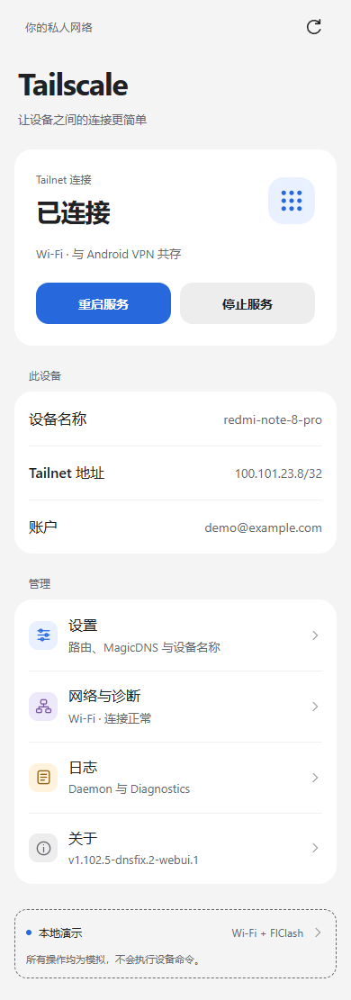
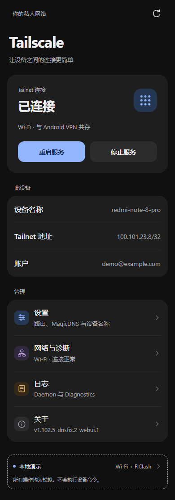
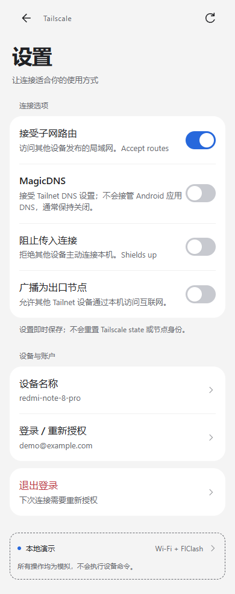
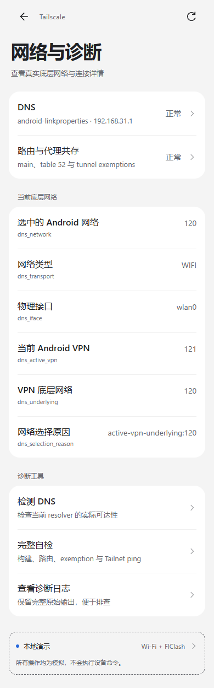
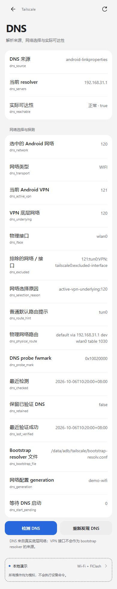
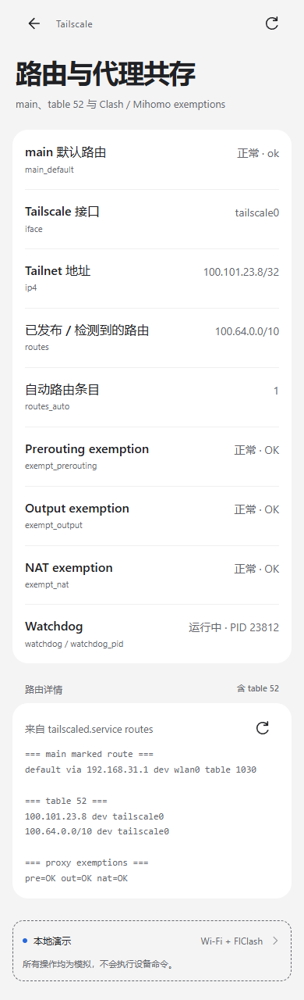

# Tailscale for Android (KernelSU / Magisk module)

[简体中文](README.md) | **English**

Maintained by **FogPurification**. Current release:
[v1.102.5-dnsfix.2-webui.2](https://github.com/ljj13/Tailscaled-fix/releases/tag/v1.102.5-dnsfix.2-webui.2).
It combines the Redmi-verified Android DNS fixes, a Miuix-inspired WebUI and
one-time Android device-name initialization, network diagnostics and the outer IPv6
routing fix on the pinned Tailscale `v1.102.5` base.
See [release notes](docs/releases/v1.102.5-dnsfix.2-webui.2.md),
[DNS audit and device tests](docs/dns/DNS_FIX.md),
[WebUI design and tests](docs/WEBUI_MIUIX.md),
[hostname initialization](docs/ANDROID_HOSTNAME.md) and
[documentation index](docs/README.md).

This release includes [network diagnostics](docs/NETWORK_DIAGNOSTICS.md):
endpoints, DERP regions, peer paths, UDP/NAT and marked outer routes, shown only
on the WebUI network detail page.

Redmi Note 8 Pro cellular tests with FlClash OFF/ON restored **IPv6 direct at
37–80 ms**. The watchdog updates the physical policy automatically when switching
Wi-Fi/cellular. On the tested IPv4-only Wi-Fi, it removes the old cellular policy
and retains DERP fallback; direct is not forced. Existing fwmark, IPv4 main route,
table52/1099, DNS, proxy exemptions and node identity are preserved.
See the [IPv6 device verification report](docs/testing/IPV6_MARKED_ROUTING.md).

A self-contained module that runs `tailscaled` on a rooted Android device and
lets browsers and apps reach the tailnet and a peer's advertised subnets.

It is built **`GOOS=linux`** on purpose — see below — and carries the three fixes
that make a linux build survive Android.

Forked from [mgksu/tailscaled](https://github.com/mgksu/tailscaled) (itself a
fork of [anasfanani/Magisk-Tailscaled](https://github.com/anasfanani/Magisk-Tailscaled)).

---

## Why `GOOS=linux`, not `GOOS=android`

The obvious build for a phone is `GOOS=android`, and it is what most modules try.
It **cannot work for a standalone daemon**. `wgengine/router` gets its
implementation from `router.HookNewUserspaceRouter`, and that hook is only ever
registered by `osrouter`'s platform files — while `osrouter/router_linux.go`
carries `//go:build !android`. Build for android and the hook stays empty, so:

```
wgengine.NewUserspaceEngine(tun "tailscale0") error: creating router: unsupported OS "android"
getLocalBackend error: createEngine: creating router: unsupported OS "android"
```

tailscaled exits immediately. (The official Android app only avoids this because
it ships its own Java `VpnService` router and registers it on that hook.
`--tun=userspace-networking` also starts, but then nothing is routed at the
kernel level, so no browser or app could ever reach `192.168.100.1`.)

So this module builds `GOOS=linux` and makes the linux build survive Android.

### The one thing that breaks, and the fix

With `GOOS=linux`, osrouter is active and tags tailscaled's own sockets with the
**bypass mark**, routing them with `ip rule ... lookup main`. **Android's `main`
table has no default route** — netd keeps its default in per-network tables such
as `rmnet_data3` — so the daemon's own traffic to the control plane and DERP dies
with `network is unreachable` and the node never comes up.

The module therefore keeps a default route in `main` (plus a connected route for
the source subnet) and re-asserts it whenever netd rewrites the tables.

Two kernel-level collisions are handled too:

| Problem | Fix |
|---|---|
| Stock marks `0x40000` / `0x80000` collide with the **"permission" bits (18–19)** of Android's `netd` fwmark layout, misrouting the control plane | build patch moves them to reserved bits: `0x8000000` and `0x10020000` (`patches/linuxfw-mark.patch`) |
| A TPROXY proxy (Surfing/Clash) jumps `DIVERT` at mangle `PREROUTING` rule 1 and hijacks the tunnel's TCP replies — ping works, the browser hangs | the module keeps `-i tailscale0 -j RETURN` at rule 1 of mangle `PREROUTING` and `-o tailscale0 -j RETURN` at rule 1 of mangle/nat `OUTPUT`, re-asserted every 15 s |

Everything else is osrouter's job, and it does it well: it installs its rules at
preference 5210–5270 (ahead of netd's 11000) and puts the tailnet prefixes — plus
**any subnet route you accept** — into table 52. So there is no route management
to do by hand.

## Install

1. Download the latest `tailscaled-<version>.zip` from
   [this repository's Releases](https://github.com/ljj13/Tailscaled-fix/releases).
   The release also includes `<filename>.zip.sha256`; verify it before installing.
2. Install it in KernelSU / Magisk / APatch and reboot.
3. Log in:

```sh
su -c 'tailscale login'
```

Use the WebUI's MagicDNS switch to change the existing Tailscale DNS preference.
The Android DNS bootstrap helper discovers physical-network resolvers, follows
VPN underlying networks and excludes VPN/Tailscale interfaces. It uses private
resolver files, so a missing `/etc/resolv.conf` or `[::1]:53` listener does not
block daemon startup. This does not install a global Android/netd DNS override.

Upgrade by installing the new ZIP over the existing module, then rebooting.
Existing Tailscale state/login identity, `settings.ini`, manual routes and
hostname protection markers are retained. No logout or node deletion is needed.

---

## Configuration: what lives where

Two directories matter. The **module directory** is what the manager installs and
replaces; the **state directory** holds everything that must survive an update.

```
/data/adb/modules/tailscaled/            module dir (replaced on update)
├── module.prop                          id/name/version; description shows the run state
├── system/bin/tailscale                 CLI wrapper (blocks `tailscale update`)
├── system/bin/tailscaled                daemon wrapper
├── system/bin/tailscaled.service        control-command wrapper
└── META-INF/ customize.sh               installer only

/data/adb/service.d/tailscaled_service.sh  boot entry (installed by customize.sh)

/data/adb/tailscale/                     state dir (KEPT across module updates)
├── settings.ini         <-- paths, TUN name, table id, rule priority
├── routes               optional manual prefixes (osrouter handles the normal case)
├── bin/
│   ├── tailscale        combined binary (CLI)
│   ├── tailscaled       combined binary (daemon)
│   ├── tailscaled.orig  known-good copy for the binary guard
│   ├── tailscaled.sha256
│   ├── android-dns       physical network / DNS discovery helper
│   ├── android-hostname  one-time hostname preference helper
│   └── android-netdiag   read-only network diagnostics
├── scripts/             start.sh, tailscaled.service, tailscaled.inotify
└── run/                 state and logs
    ├── tailscaled.state     identity + Tailscale preferences (login lives here)
    ├── tailscaled.sock
    ├── tailscaled.log       daemon log
    ├── diag.log             what the routing logic did, step by step
    ├── runs.log / service.log
    └── tailscaled.pid / watchdog.pid
```

`settings.ini` and `routes` are only copied **on first install**, so your edits
survive module updates. Deleting them restores the defaults.

| What you want to change | Where |
|---|---|
| Which networks go through the tunnel | `/data/adb/tailscale/routes`, then `tailscaled.service restart` |
| TUN name / table id / rule priority (advanced) | `/data/adb/tailscale/settings.ini` |
| MagicDNS, hostname, Shields up, advertised exit node, `--accept-routes` | Tailscale preferences, stored in `run/tailscaled.state`; use the WebUI or `tailscale set --hostname=...`, `tailscale set --accept-routes` |
| Anything about a proxy | not in this module — see the coexistence section |

`--accept-routes` lets osrouter install accepted subnet routes into table 52.
The manual `routes` file is an optional fallback; it is not required for ordinary
accepted subnet routes.

When `Prefs.Hostname` is empty, the module initializes it once from Android's
user device name, then marketname/model/device fallbacks. Names are normalized
to a legal lowercase DNS label. Existing overrides are preserved, and manual
hostname requests through the WebUI or module CLI permanently disable automatic
initialization. The reported OS remains Linux because the daemon uses GOOS=linux.

## WebUI

The module ships a pure HTML/CSS/JS WebUI for KernelSU / APatch and compatible
Magisk WebUI hosts. Open it from your manager's module card when WebUI is
supported. The interface follows Miuix / HyperOS settings-page conventions:
large titles, grouped rounded cards, preference rows, switches and secondary
pages with Back navigation. It follows the system light/dark theme, supports
safe areas and uses local resources and system fonts.

| Page | What it does |
|---|---|
| **Home / 首页** | Connection state, device/Tailnet/account information, start/stop/restart and login. |
| **Settings / 设置** | Accept routes, MagicDNS, Shields up, advertised exit node, hostname and login/logout. |
| **Network / 网络详情** | Physical interface, Android VPN underlying network, selftest and links to advanced details. |
| **DNS diagnostics** | Resolver source, network/transport, selected/excluded interfaces, reachability and marked probes; all dnsfix.2 fields retained. |
| **Routing details** | Main route, table 52, discovered/manual routes and proxy exemptions. |
| **Logs / 日志** | Daemon and diagnostic output, refresh/copy/clear. |
| **About / 关于** | Module version, author, build information and supported capabilities. |

Native actions retain the existing service/CLI API. The bridge uses physical
installed entry points and preserves socket settings, so it does not rely on
system-overlay command discovery. Status polling pauses while the page is hidden.

The screenshots below are **desktop browser mock data**, not phone captures.
The UI in these screenshots is in Chinese; the same images are used in both README versions.
See the [complete screenshot gallery](docs/screenshots/webui/README.md).

| Home · light | Home · dark | Settings |
|---|---|---|
|  |  |  |

| Network | DNS diagnostics | Routing |
|---|---|---|
|  |  |  |

To preview without a phone:

```sh
python -m http.server 8765 --bind 127.0.0.1 --directory webroot
```

Open `http://127.0.0.1:8765/?demo=wifi`. Other scenarios are `cellular`,
`needs-login`, `failure` and `stopped`. Forced demo mode never calls the native
root bridge.

## Commands

```sh
# service
tailscaled.service start|stop|restart|status
tailscaled.service routes            # routing that is installed (manual + discovered)
tailscaled.service routes-reload     # re-read the route files and apply
tailscaled.service routes-sync       # discover tailnet subnets and apply them
tailscaled.service diag              # full diagnostic dump
tailscaled.service dns               # DNS source and reachability
tailscaled.service dns-refresh       # rediscover Android DNS
tailscaled.service selftest          # build, DNS, routing and ping diagnostics
tailscaled.service selftest <peer-ip> # optionally select the peer to test
tailscaled.service netdiag           # structured network diagnostic JSON (main)
tailscaled.service webstatus         # machine-readable state (what the WebUI uses)
tailscaled.service prefs             # machine-readable Tailscale preferences
tailscaled.service log {runs|service|tailscaled|diag}

# preferences (whitelisted: accept-routes, accept-dns, shields-up,
# advertise-exit-node, advertise-routes, hostname, auto-update)
tailscaled.service set-pref accept-routes on
tailscaled.service set-pref accept-dns off
tailscaled.service set-pref advertise-routes 192.168.1.0/24
tailscaled.service logout

# the CLI, as usual
tailscale status
tailscale ip
tailscale ping <peer>
```

`tailscaled.service diag` prints the binary hash vs. the expected one, the daemon
and watchdog PIDs, the installed routes and rules, whether a proxy's `DIVERT`
jump is present, and the tail of the logs. **Start there when something is off.**

---

## Reaching a peer's advertised subnet

Nothing to configure by hand. osrouter installs accepted subnet routes into
table 52 for you, so it is two steps:

```sh
su -c 'tailscale set --accept-routes'
```

and the peer's route must be approved in the admin console. Then
`http://192.168.100.1` works in any browser.

The WebUI does the same thing: **Settings → Accept subnet routes**.

Check it with `tailscaled.service routes`, which prints table 52:

```
mode:                    osrouter (linux build) - tailscaled owns the routing
default route in main:   default via 10.20.30.1 dev rmnet_data3
tailnet in table 52:
  100.64.0.0/10 dev tailscale0
  192.168.100.0/24 dev tailscale0
```

`/data/adb/tailscale/routes` still exists as a manual fallback if you ever need
to force a prefix into the tunnel, but you should not need it.

## Coexisting with a proxy (Surfing / Clash / Mihomo / anything)

**You do not need to edit the proxy's configuration.** This module never marks or
reroutes anything except the tailnet prefixes, so it does not compete with a proxy
for traffic.

What a proxy *can* do is intercept the tunnel itself. On every start — and every
15 s afterwards — the module puts a `RETURN` for tunnel traffic at rule 1 of three
chains:

```sh
iptables -t mangle -I PREROUTING 1 -i tailscale0 -j RETURN   # replies coming back
iptables -t mangle -I OUTPUT     1 -o tailscale0 -j RETURN   # packets leaving
iptables -t nat    -I OUTPUT     1 -o tailscale0 -j RETURN   # REDIRECT-style proxies
```

These are harmless with no proxy installed (they simply return early for tunnel
traffic) and they name **no proxy**, so **switching to a different proxy module
needs no change here**. `tailscaled.service diag` shows whether each one is in
place.

### Why the inbound rule matters

Surfing's TPROXY inserts a `DIVERT` jump at mangle `PREROUTING` rule 1:

```sh
iptables -t mangle -I PREROUTING -p tcp -m socket -j DIVERT
```

It matches **TCP only** and has no interface condition. `DIVERT` marks
(`0x1000000`) and `ACCEPT`s the packet, so the SYN-ACK of every TCP connection
leaving through `tailscale0` is routed to the proxy's TPROXY port instead of the
local socket and **the handshake never completes**. ICMP is never matched, which
is why the symptom is the deceptive *"ping works, but the browser/curl hangs"*.

The exemption must be rule 1 **of `PREROUTING` itself**. Putting it inside
`BOX_EXTERNAL` does nothing, because `DIVERT` is evaluated first.

If you would rather do it in the proxy's own config, Surfing's
`ignore_out_list=("tailscale0")` handles the outbound direction — but it is not
required, and it does not fix the inbound direction.

## Notes and limitations

* **arm64 only.**
* **No Tailscale SSH** — built with `ts_omit_ssh`.
* **Using an exit node is not supported** (advertising this device as one is
  supported). This release retains the existing service restriction on selecting
  another exit node.
* **No UPX.** The binary is shipped uncompressed; UPX needs executable anonymous
  mappings, which some ROMs/SELinux policies refuse.

---

## Layout

See the [development guide](docs/DEVELOPMENT.md) for directory responsibilities
and test commands (in Chinese).

```
META-INF/                 installer
customize.sh              installs to /data/adb/tailscale, stores the binary guard
service.sh                boot entry (waits for boot, then runs start.sh)
system/bin/               tailscale / tailscaled / tailscaled.service wrappers
webroot/                  KernelSU / APatch WebUI (index.html, app.js, ksu.js, style.css)
tailscale/settings.ini    all paths, prefixes, table ids  -> /data/adb/tailscale/
tailscale/routes          prefixes routed into the TUN     -> /data/adb/tailscale/
tailscale/scripts/        start.sh, tailscaled.service, tailscaled.inotify
uninstall.sh              stops the daemon and removes our routes
```

`settings.ini` and `routes` are only copied on first install, so your edits
survive module updates.

---

## Building

Run `sh scripts/build.sh` under Linux/WSL with Go 1.26.6 and Python 3. The build
pins Tailscale v1.102.5, applies the existing fwmark patch and Android DNS patches,
runs the relevant tests, and packages `dist/tailscaled-v1.102.5-dnsfix.2-webui.2-arm64.zip`.
The branch workflow produces an artifact; it does not change main or publish a
release automatically. The module does not subscribe to upstream's updater,
which could replace this DNS fix with another build.

The published WebUI 2 ZIP reuses the exact accepted dnsfix.2 daemon and DNS helper
binaries. Use the release tag to reproduce the published version exactly;
To use that packaging path, obtain the accepted release ZIP in
`dist/`, then run under Linux/WSL with Go 1.26.6 on PATH:

```sh
python3 scripts/build-hostname.py
python3 scripts/build-netdiag.py
python3 -m unittest discover -s tests -p 'test_*.py' -v
node tests/webui-command.test.cjs
node tests/network-ui.test.cjs
node tests/webui.test.cjs
python3 scripts/package-webui.py --release
```

The packager verifies the accepted ZIP hash, helper source/binary hashes,
static arm64 ELF, Unix modes, module metadata and ZIP CRC. It writes a matching
`.zip.sha256` sidecar and embeds UI/helper provenance.

Browser-test tooling is kept in ignored `build/browser-tools/`: install
`playwright` and `acorn` there with npm before running the Node tests. Windows
uses the installed Edge browser by default; on Linux set `WEBUI_BROWSER` to the
absolute path of an installed Chromium-compatible browser. These dependencies
are test tooling and are not shipped in the module.

---

## Credits

* [keweiya/tailscaled](https://github.com/keweiya/tailscaled) — the v1.102.5 module base
* [anasfanani/Magisk-Tailscaled](https://github.com/anasfanani/Magisk-Tailscaled) — original module
* [mgksu/tailscaled](https://github.com/mgksu/tailscaled) — the fork this is based on
* [Tailscale](https://tailscale.com) — BSD-3-Clause
